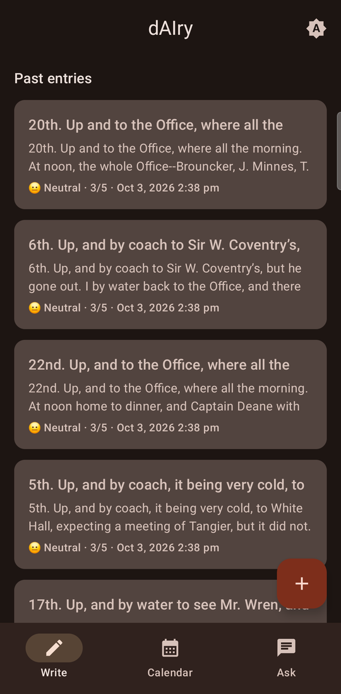
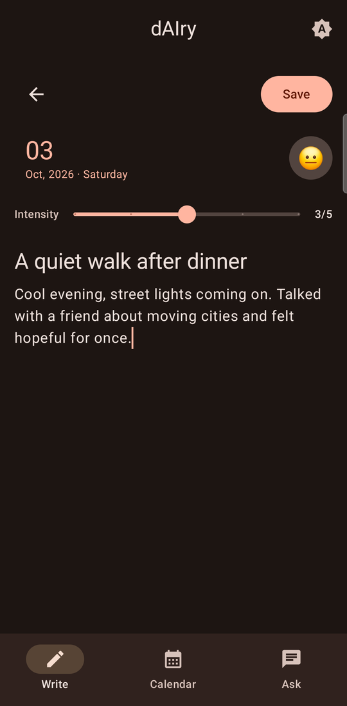
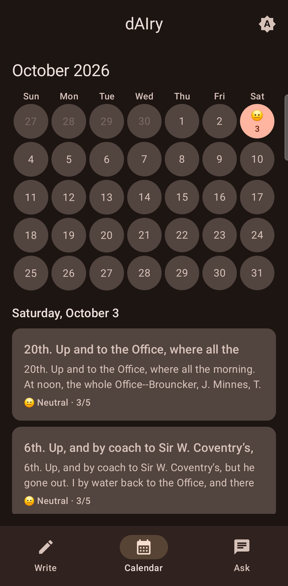
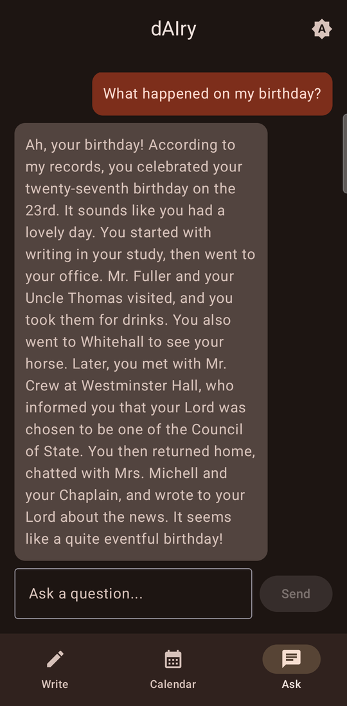

# dAIry

A private, offline-first journal for Android. You write entries with a text
and an emotion + intensity, everything is stored locally on your device, and
you can later *talk to your diary* — ask it questions and get answers grounded
in your own past entries — using a Gemma model running entirely on-device.

No entry, embedding, or question ever needs to leave the phone.

> **Status: working app, in daily use.** Writing entries, editing/deleting
> them, browsing by calendar, and chatting with an on-device Gemma model
> grounded in your own entries are all implemented and verified on a real
> device. A few things are still open — chat history isn't persisted yet,
> and there's no in-app model download flow — see [Roadmap](#roadmap).

## Screenshots

Running on a real phone, fully on-device. The entries shown are public-domain
diary text (Samuel Pepys) used as test data, not personal entries.

| Entries | Write | Calendar | Ask your diary |
|---|---|---|---|
|  |  |  |  |

## Features

- Write entries with free text, a title, a date (backdate freely), and an
  emotion + 1–5 intensity, picked from a bottom-sheet mood grid.
- Edit or delete any past entry; embeddings are re-computed or removed to
  match.
- Browse entries by calendar month, with a mood emoji per day.
- Everything stored locally (Room/SQLite) — no account, no server, no sync.
- Ask natural-language questions about your own diary; a RAG pipeline finds
  the most relevant past entries and an on-device Gemma model answers using
  only that retrieved context.
- Fully offline after the model is downloaded once.

## How it works

```
Write entry ──► embed text ──► store {text, emotion, intensity, embedding}
                                         (Room / SQLite, on-device)

Ask question ──► embed question ──► cosine similarity over stored
                                     embeddings (brute force, in-app)
                                         │
                                         ▼
                              top-k most relevant entries
                                         │
                                         ▼
                          prompt Gemma (MediaPipe LLM Inference)
                                         │
                                         ▼
                                    answer shown in chat
```

Full write-up in [docs/ARCHITECTURE.md](docs/ARCHITECTURE.md).

## Tech stack

| Layer | Choice |
|---|---|
| Language / UI | Kotlin, Jetpack Compose, Material 3 |
| Local storage | Room (SQLite) — entries + their embeddings live in one table |
| Retrieval (RAG) | Brute-force cosine similarity, computed in-app (no vector DB dependency) |
| On-device LLM | [Google AI Edge — MediaPipe LLM Inference API](https://ai.google.dev/edge/mediapipe/solutions/genai/llm_inference) running a Gemma `.task` model, **or** [ML Kit GenAI Prompt API](https://developers.google.com/ml-kit/genai/prompt/android) (AICore/Gemini Nano) when the device supports it — see [GemmaInferenceEngineProvider](app/src/main/java/com/yashjayswal/dairy/ai/llm/GemmaInferenceEngineProvider.kt) |
| On-device embeddings | [MediaPipe Text Embedder API](https://ai.google.dev/edge/mediapipe/solutions/text/text_embedder/android) running a `.tflite` embedding model |
| Concurrency | Kotlin Coroutines |

Why brute-force cosine similarity instead of a vector database: at realistic
personal-diary scale (thousands to tens of thousands of entries) it's fast
enough (tens of milliseconds), has zero extra native/proprietary
dependencies, and is simple enough to read top-to-bottom — see
[docs/HUMAN_IN_THE_LOOP.md](docs/HUMAN_IN_THE_LOOP.md) for why that matters
for this project specifically.

## Requirements

Full breakdown (APIs, permissions, RAM, storage, min SDK) in
[docs/REQUIREMENTS.md](docs/REQUIREMENTS.md). Short version:

- Android 8.0 (API 26) minimum, Android 12+ recommended for GPU acceleration.
- **~4 GB RAM minimum, 6–8 GB+ recommended** to run a quantized Gemma model
  smoothly alongside the rest of the app.
- The Gemma model file (several hundred MB to a few GB depending on variant)
  is **not** bundled in the APK — it's downloaded/pushed to the device
  separately.
- One-time `INTERNET` permission use for the initial model download only;
  no network access is required for journaling or chatting with your diary.

## Getting started

**Fastest path — prebuilt APK:** every push to `master` auto-builds a debug
and a release APK and attaches both to the
[`latest` GitHub Release](https://github.com/YashJayswal24/dAIry/releases/tag/latest).
Debug (`app-debug.apk`, `com.yashjayswal.dairy.debug`) and release
(`app-release.apk`, `com.yashjayswal.dairy`, minified) install side-by-side
as separate apps with separate data. Release is currently signed with the
debug keystore (not yet Play-Store-ready — see
[docs/TODO.md](docs/TODO.md)). Neither bundles the Gemma/embedding model
files; push those separately per
[docs/RUNNING_ON_DEVICE.md](docs/RUNNING_ON_DEVICE.md).

**Building from source:**

1. Clone the repo and open it in Android Studio (Ladybug or newer). Android
   Studio will offer to generate the Gradle wrapper on first sync — accept it.
2. Obtain a Gemma `.task` model converted for MediaPipe LLM Inference (see
   [docs/REQUIREMENTS.md](docs/REQUIREMENTS.md) for where to get one and
   which size fits your target device's RAM).
3. Push the model to the device (e.g. `adb push gemma-model.task
   /data/local/tmp/dairy/`) — an in-app downloader/picker is on the roadmap.
4. Build and run `app` on a physical device (emulators are slow for on-device
   LLM inference and may not have enough RAM). Step-by-step device setup
   (Samsung phone, developer options, adb, pushing a model file, battery
   optimization gotchas) is in
   [docs/RUNNING_ON_DEVICE.md](docs/RUNNING_ON_DEVICE.md).

## Project structure

```
app/src/main/java/com/yashjayswal/dairy/
├── data/
│   ├── local/          # Room database, entity, DAO, embedding <-> bytes codec
│   └── repository/      # bridges domain models and Room
├── domain/model/         # DiaryEntry, Emotion
├── ai/
│   ├── embedding/        # EmbeddingEngine interface (text -> vector)
│   ├── llm/              # GemmaInferenceEngine interface (prompt -> text);
│   │                     # MediaPipe + AICore implementations, picked at
│   │                     # runtime by GemmaInferenceEngineProvider
│   └── rag/              # RagRetriever: cosine similarity over stored entries
└── ui/
    ├── entry/            # write-an-entry screen
    ├── chat/             # ask-your-diary screen
    └── theme/
```

## Roadmap

Short summary below — see [docs/TODO.md](docs/TODO.md) for the detailed,
working version (what each item actually involves, and notes for picking
work back up).

- [x] `EntryRepository` (embed-on-save, map rows back to domain model)
- [x] Unit tests for `EmbeddingCodec`, `RagRetriever`, `EntryRepository`
- [x] Implement `EmbeddingEngine` (`MediaPipeEmbeddingEngine`, MediaPipe Text Embedder)
- [x] Implement `GemmaInferenceEngine` — `MediaPipeGemmaInferenceEngine` (bundled `.task` model, any device) plus `AiCoreGemmaInferenceEngine` (Gemini Nano via AICore, flagship devices only), picked at runtime by `GemmaInferenceEngineProvider`
- [x] Emotion + intensity picker UI (`EntryScreen`: text field, emotion chips, 1–5 slider, save button wired to `EntryRepository`, past-entries list)
- [x] Prompt template for RAG — `RagPromptBuilder`, **simple version on purpose**: embeds the user's raw question directly and retrieves with it, no LLM-driven query rewriting/keyword-extraction step first. Dense embeddings already handle paraphrasing, and an extra LLM call would double on-device generation latency. Revisit only if real usage shows retrieval missing relevant entries, or once multi-turn follow-up questions are supported (that's the case query *condensation* — using conversation history to resolve an ambiguous follow-up — genuinely earns its cost, unlike single-shot keyword extraction).
- [x] Chat UI wired end-to-end — `ChatScreen` calls `ChatAnswerer` (`RagRetriever` → `RagPromptBuilder` → the cached `GemmaInferenceEngine`) on send; the wiring and error path are verified on a Galaxy S26 Ultra, real generated replies not yet read (see TODO.md)
- [x] Visual redesign — custom warm color theme (was untouched Material3 defaults), `Scaffold` with a top app bar + icon `NavigationBar`, card-based `EntryScreen` with emoji mood chips, verified on-device in dark mode (see TODO.md for the "My Diary"-inspired future feature list: calendar view, search, tags, etc.)
- [x] Judged chat eval suite ([docs/EVAL_PROMPTS.md](docs/EVAL_PROMPTS.md)) — all 15 ground-truthed prompts run and scored on-device via a debug-only instrumented test harness (calls `ChatAnswerer` directly, no UI automation); found two real bugs: dates/emotions never reach the chat prompt at all, and AICore's `BUSY` quota needs retry-with-backoff handling (see TODO.md backlog)
- [x] Calendar view — month grid (`com.kizitonwose.calendar:compose`), mood emoji per day, tap a day to see its entries; first of several "My Diary"-inspired UI replicas (see TODO.md)
- [x] Edit and delete entries — full-screen `EntryDetailScreen` (Close/Edit/Delete, confirm-before-delete, Previous/Next between entries), shared by the entries list and the calendar day view
- [x] Title field + backdating — real Room `Migration(1, 2)` adding `title` (not a destructive wipe — see the recorded incident/recovery in TODO.md), `EntryComposeScreen` (a dedicated full-screen write page with a date picker) replaces the old inline compose card
- [x] Mood picker redesign — a circular avatar opens a bottom-sheet grid (`EmotionPickerSheet`), replacing the inline `FilterChip` row; borderless `PlainTextField`s replace boxed Material3 `TextField`s, both modeled on reference screenshots (see TODO.md)
- [x] Confirm a successful entry save on a real device — extensively confirmed on-device this pass (save, edit, delete, backdate all verified against the live Room db)
- [x] Separate debug/release builds — distinct application ids (`applicationIdSuffix`) so they install side-by-side with separate data; release minification (R8) fixed after diagnosing crashes in AICore's and MediaPipe's native/reflection-dependent code (see TODO.md); CI now builds and auto-publishes both APKs on every push
- [ ] Persist chat history (messages are still in-memory only — lost on navigating away or app restart)
- [ ] Finalize Room schema/migrations — real migration infrastructure now exists (`MIGRATION_1_2`), but the broader strategy/versioning discipline is still informal
- [ ] In-app model download/selection flow
- [ ] Verify `MediaPipeGemmaInferenceEngine` end-to-end with a real `.task` file — only `AiCoreGemmaInferenceEngine` has been confirmed generating on-device so far; the file pulled from AI Edge Gallery turned out to be `.litertlm`, a different format (see REQUIREMENTS.md)

## Human in the loop

This project is scaffolded with AI assistance, but every design decision,
dependency, and line of logic is meant to be understood and controlled by
the maintainer — not just generated and merged. See
[docs/HUMAN_IN_THE_LOOP.md](docs/HUMAN_IN_THE_LOOP.md).

## License

Licensed under the [Apache License, Version 2.0](LICENSE). You're free to
use, modify, and redistribute this project — including commercially —
provided you retain the copyright/attribution notice (see [NOTICE](NOTICE))
and comply with the License's terms.

Copyright © 2026 [Yash Jayswal](https://github.com/YashJayswal24)
